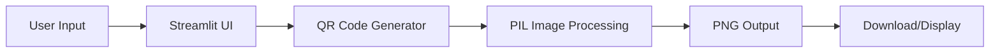

# 📱 QR Code Generator Pro

<div align="center">


[](https://streamlit.io)
[](http://makeapullrequest.com)

</div>

## 🌟 Overview

**QR Code Generator Pro** is a powerful, multilingual web application that allows you to generate professional QR codes instantly. Perfect for businesses, events, marketing campaigns, and personal use. Built with Streamlit and Python, it offers a clean interface with extensive customization options.

### ✨ Key Features

| Feature | Description |
|---------|-------------|
| 🌐 **Multilingual Support** | Available in French, English, Arabic (RTL), and Spanish |
| 🎨 **Custom Colors** | Choose any colors for QR code and background |
| 📏 **Size Control** | Adjust QR code size from 5 to 20 pixels per block |
| 🖼️ **Border Control** | Customizable quiet zone around the QR code |
| 📥 **Easy Download** | Download QR codes as high-quality PNG files |
| 📊 **Statistics** | Track number of QR codes generated |
| 💡 **Smart Tips** | Best practices and usage examples included |
| 🚀 **Real-time Preview** | Instant generation and preview |

## 🚀 Quick Start

### Prerequisites

- Python 3.7 or higher
- pip package manager

### Installation

1. **Clone the repository**
```bash
git clone https://github.com/yourusername/qr-generator-pro.git
cd qr-generator-pro
```

2. **Install dependencies**
```bash
pip install qrcode[pil] pillow streamlit
```

3. **Run the application**
```bash
streamlit run qr_generator.py
```

4. **Open your browser**
```
http://localhost:8501
```

## 📖 Usage Guide

### Basic Usage

1. **Enter your URL or text** in the input field
2. **Customize** the QR code appearance (optional)
3. **Click "Generate QR Code"**
4. **Download** the QR code as PNG

### Advanced Features

#### 🎨 Customization Options
- **Box Size**: Controls the pixel size of each QR module (5-20px)
- **Border**: Adjust the quiet zone around the QR code (1-10px)
- **Color Schemes**: Choose between classic black & white or custom colors
- **Background Color**: Set any background color for your QR code

#### 🌍 Language Support
- 🇫🇷 **French** - Français
- 🇬🇧 **English** - English  
- 🇸🇦 **Arabic** - العربية (with RTL support)
- 🇪🇸 **Spanish** - Español

## 🎯 Use Cases

### Business Applications
- 📱 **Marketing Materials**: Add QR codes to flyers, posters, and business cards
- 🏪 **Product Information**: Link to product pages or specifications
- 📋 **Form Submissions**: Easy access to Google Forms and surveys
- 🔗 **Link Shortening**: Share long URLs in a scannable format

### Personal Use
- 📞 **Contact Information**: Share vCards and contact details
- 🌐 **Social Media**: Quick links to profiles and pages
- 📝 **Text Messages**: Share notes and important information
- 🏠 **WiFi Sharing**: Easy WiFi network access

### Technical Applications
- 🔐 **Secure Links**: Generate QR codes for authentication
- 📊 **Analytics Tracking**: Track scan metrics with unique QR codes
- 🏥 **Healthcare**: Patient information and medical records
- 🎓 **Education**: Share resources and assignments

## 🔧 Technical Details

### Architecture



### Dependencies

```python
qrcode[pil]  # QR code generation
pillow       # Image processing
streamlit    # Web interface
io           # Bytes I/O handling
time         # Timestamp generation
```

### File Structure

```
qr-generator-pro/
├── qr_generator.py      # Main application
├── README.md            # Documentation
├── requirements.txt     # Dependencies
├── LICENSE             # MIT License

```

## 📊 Performance

| Metric | Value |
|--------|-------|
| Generation Time | < 1 second |
| File Size | 5-50 KB |
| Max URL Length | 2953 characters |
| Supported Formats | PNG, JPEG |
| Max QR Size | 20px per block |

## 🔒 Security Features

- ✅ No data storage - everything is client-side
- ✅ No external API calls
- ✅ Local processing only
- ✅ No tracking or analytics
## Quick Setup Commands
```
# Create project directory
mkdir qr-generator-pro
cd qr-generator-pro

# Create virtual environment
python -m venv venv

# Activate virtual environment (Windows)
venv\Scripts\activate

# Activate virtual environment (Mac/Linux)
source venv/bin/activate

# Install dependencies
pip install qrcode[pil] pillow streamlit

# Create the Python file
touch qr_generator.py

# Create README
touch README.md

# Run the application
streamlit run qr_generator.py
```
## 🌟 Pro Tips

1. **Optimal Scanning**: Use high contrast colors (dark on light)
2. **Size Matters**: Minimum 2x2 cm for physical printing
3. **Test First**: Always test with multiple QR scanners
4. **Error Correction**: M-level (15%) error correction included
5. **URL Shortening**: Use URL shorteners for complex links

## 🐛 Troubleshooting

### Common Issues

| Issue | Solution |
|-------|----------|
| QR code not scanning | Increase box size or check contrast |
| File not downloading | Check browser permissions |
| Language not changing | Refresh the page after selection |
| Error generating QR | Verify URL format is correct |

## 🚀 Future Updates

- [ ] Dynamic QR codes (updatable content)
- [ ] Batch generation
- [ ] SVG output format
- [ ] QR code analytics
- [ ] Custom logo embedding
- [ ] API endpoints
- [ ] Mobile app version

## 🤝 Contributing

Contributions are welcome! Please feel free to submit a Pull Request.

1. Fork the repository
2. Create your feature branch (`git checkout -b feature/AmazingFeature`)
3. Commit your changes (`git commit -m 'Add some AmazingFeature'`)
4. Push to the branch (`git push origin feature/AmazingFeature`)
5. Open a Pull Request

## 📝 License

This project is licensed under the MIT License - see the [LICENSE](LICENSE) file for details.

## 👥 Authors

- **Your Name** - *Initial work* - [YourGithub](https://github.com/yourusername)

## 🙏 Acknowledgments

- [Streamlit](https://streamlit.io/) for the amazing framework
- [QRCode](https://github.com/lincolnloop/python-qrcode) library
- [Pillow](https://python-pillow.org/) for image processing
- All contributors and users of this project

## 📞 Support

For support, email: your-email@example.com  
Or open an issue in the GitHub repository.

---

<div align="center">
Made with ❤️ using Python and Streamlit


 
